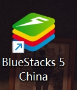
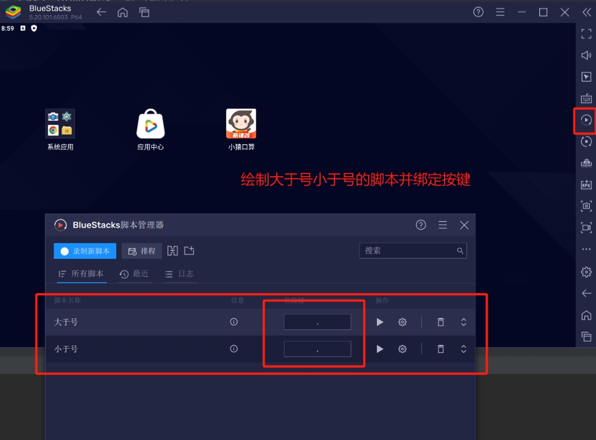
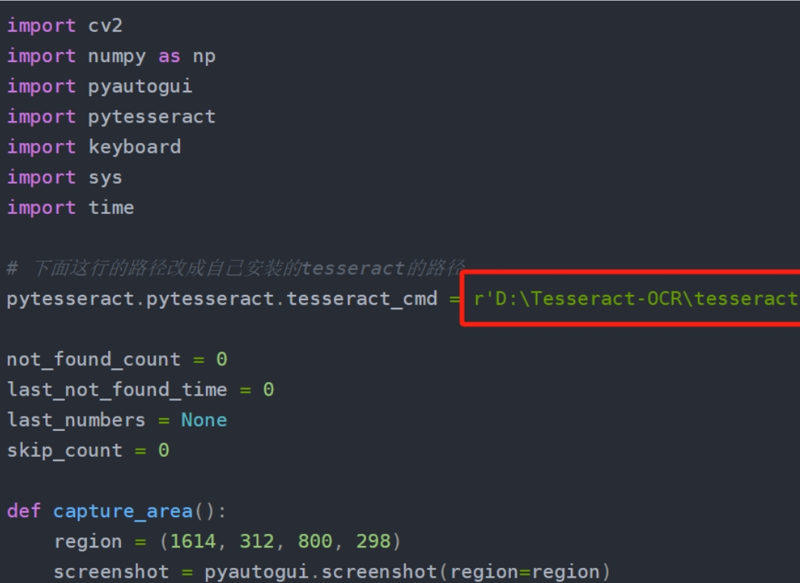
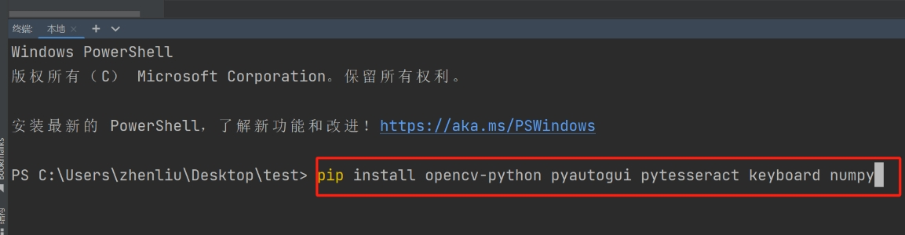
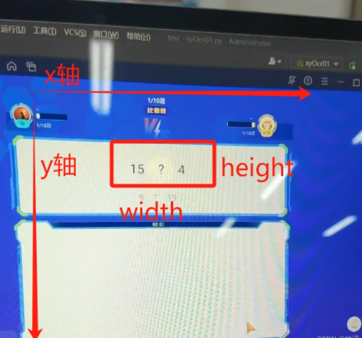
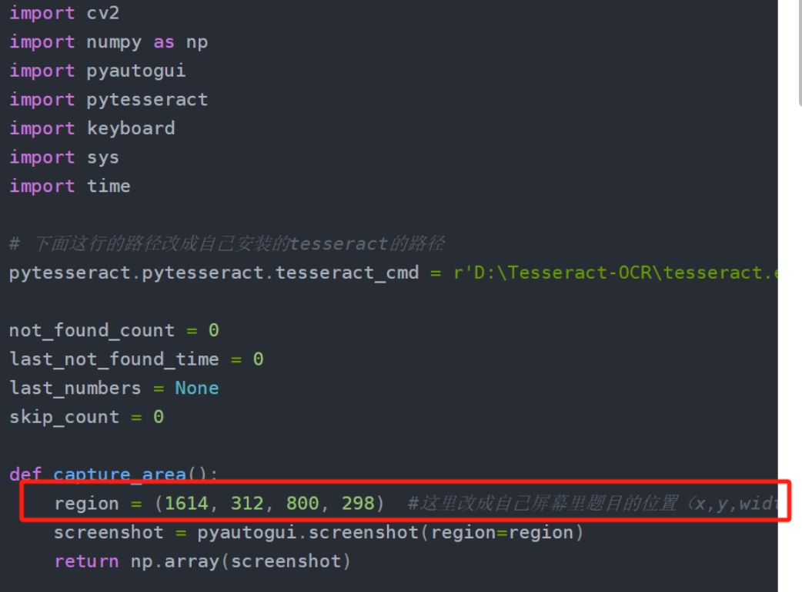

**代码如下：**
~~~python
import cv2
import numpy as np
import pyautogui
import pytesseract
import keyboard
import sys
import time

# 下面这行的路径改成自己安装的tesseract的路径
pytesseract.pytesseract.tesseract_cmd = r'D:\Tesseract-OCR\tesseract.exe'

not_found_count = 0
last_not_found_time = 0
last_numbers = None  
skip_count = 0  

def capture_area():
    region = (1614, 312, 800, 298)  #这里改成自己屏幕里题目的位置（x,y,width,height）
    screenshot = pyautogui.screenshot(region=region)
    return np.array(screenshot)

def recognize_numbers(image):
    gray = cv2.cvtColor(image, cv2.COLOR_BGR2GRAY)
    _, thresh = cv2.threshold(gray, 150, 255, cv2.THRESH_BINARY)
    text = pytesseract.image_to_string(thresh, config='--psm 6')
    numbers = [int(s) for s in text.split() if s.isdigit()]
    return numbers

def draw_comparison(numbers):
    global not_found_count, last_not_found_time, last_numbers, skip_count

    if len(numbers) < 2:
        current_time = time.time()
        if not_found_count == 0 or current_time - last_not_found_time > 1:
            not_found_count = 1
        else:
            not_found_count += 1

        last_not_found_time = current_time
        print("未识别到题目")

        if not_found_count >= 25:
            pyautogui.click(280, 840)  # 点击“开心收下”按钮
            time.sleep(0.3)
            pyautogui.click(410, 990)  # 点击“继续”按钮
            time.sleep(0.3)
            pyautogui.click(280, 910)  # 点击“继续PK”按钮
            time.sleep(13)
            print("准备重新开始程序...")
            time.sleep(0.3)
            main()
        return

    if last_numbers is not None and last_numbers == numbers:
        skip_count += 1
        print(f"当前结果与上次相同，跳过此次执行 (次数: {skip_count})")

        if skip_count > 5:  # 超过5次则强制执行一次
            skip_count = 0  # 重置计数器
            print("跳过次数超过5次，强制执行一次")
            # 在这里可以直接执行绘制逻辑，或根据需要处理
            first, second = numbers[0], numbers[1]
            origin_x, origin_y = 2015, 1125  # 绘制区域坐标
            size = 50

            if first > second:
                print(f"{first} > {second}")
                draw_greater_than(origin_x, origin_y, size)
            elif first < second:
                print(f"{first} < {second}")
                draw_less_than(origin_x, origin_y, size)
        return

    first, second = numbers[0], numbers[1]
    origin_x, origin_y = 250, 650  # 绘制区域坐标
    size = 50

    if first > second:
        print(f"{first} > {second}")
        draw_greater_than(origin_x, origin_y, size)
    elif first < second:
        print(f"{first} < {second}")
        draw_less_than(origin_x, origin_y, size)

    not_found_count = 0
    last_numbers = numbers  # 更新 last_numbers 为当前数字
    skip_count = 0  # 重置跳过次数

def draw_greater_than(origin_x, origin_y, size):
    pyautogui.press(".")  # 脚本快捷键,用于BlueStacks脚本管理器，这个是大于号的

def draw_less_than(origin_x, origin_y, size):
    pyautogui.press(",")  # 脚本快捷键，用于BlueStacks脚本管理器，这个是小于号的

def main():
    keyboard.add_hotkey('=', lambda: sys.exit("进程已结束"))  # 默认退出快捷键是 "="

    try:
        while True:
            image = capture_area()
            numbers = recognize_numbers(image)
            draw_comparison(numbers)
            time.sleep(0.7)  # 每次绘制及识别的延迟
    except SystemExit as e:
        print(e)

if __name__ == "__main__":
    main()
~~~
**部署教程：**
1. 安装BlueStacks 5模拟器：

3. 打开模拟器：绘制大于号小于号的脚本并绑定按键（大于号是'.' 小于号是','）

4. 安装tesseract（不会安装的话csdn搜安装教程），安装完成后第十行代码改成安装好的tesseract的路径

5. pycharm终端安装所需要的库：
~~~cmd
pip install opencv-python pyautogui pytesseract keyboard numpy
~~~

5. 用截图工具查找坐标并替换代码中的坐标

7. 运行程序

